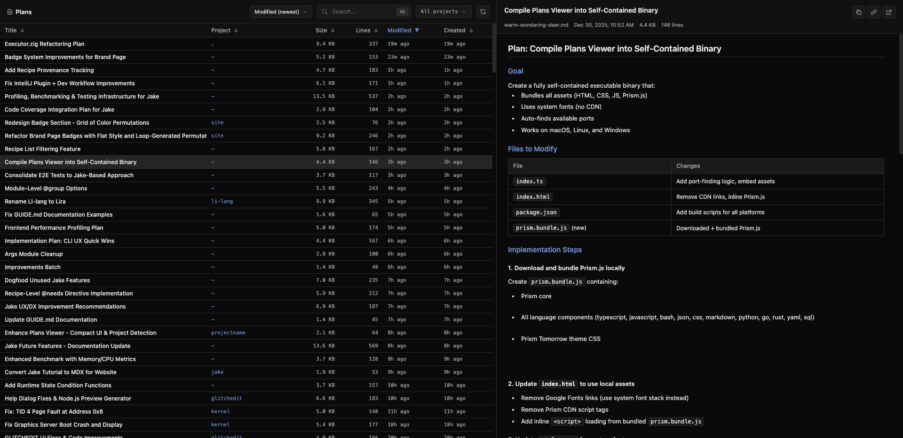

# Claude Plan Viewer

> Browse, search, and read your Claude Code plans in a clean web UI

[](https://www.npmjs.com/package/claude-plan-viewer)
[](https://opensource.org/licenses/MIT)
[](https://bun.sh)



## Features

- Browse and search all your Claude Code plans
- Sort by title, project, modified date, or size
- Full markdown rendering with syntax highlighting
- Keyboard navigation (arrow keys, Cmd+K for search)
- Dark theme UI

## Installation

### Using npx (recommended)

```bash
npx claude-plan-viewer
```

### Using bunx

```bash
bunx claude-plan-viewer
```

### Global installation

```bash
# With npm
npm install -g claude-plan-viewer

# With bun
bun install -g claude-plan-viewer
```

Then run:

```bash
claude-plan-viewer
```

### Standalone Binary

Download a pre-built binary from the [releases page](https://github.com/HelgeSverre/claude-plan-viewer/releases) or build your own:

```bash
bun run build
./dist/claude-plan-viewer
```

The binary is fully self-contained (~57MB) and works offline.

## Usage

```bash
# Start the web viewer
claude-plan-viewer

# Start on specific port
claude-plan-viewer --port 8080
claude-plan-viewer -p 8080
```

The server will automatically find an available port if the requested port is in use.

### CLI Options

| Flag                  | Short | Description                                               |
| --------------------- | ----- | --------------------------------------------------------- |
| `--port <number>`     | `-p`  | Port to start the server on (default: 3000)               |
| `--claude-dir <path>` | `-c`  | Path to `.claude` directory (default: `~/.claude`)        |
| `--json`              | `-j`  | Export all plans as JSON and exit                         |
| `--output <file>`     | `-o`  | Output file for JSON export (prints to stdout if omitted) |
| `--from-file <file>`  | `-f`  | Load plans from a JSON file instead of `~/.claude/plans`  |
| `--version`           | `-v`  | Show version number                                       |
| `--help`              | `-h`  | Show help message                                         |

The `--claude-dir` option can also be set via the `CLAUDE_DIR` environment variable. CLI flag takes precedence over the environment variable.

### Export plans to JSON

```bash
# Print all plans as JSON to stdout
claude-plan-viewer --json

# Export to a file
claude-plan-viewer --json --output plans.json
claude-plan-viewer -j -o plans.json
```

The JSON export includes all plan metadata and content, useful for backup or processing.

### Load plans from file

```bash
# Start viewer with plans from an exported JSON file
claude-plan-viewer --from-file plans.json
claude-plan-viewer -f plans.json
```

This allows viewing plans offline or from a different machine. When using `--from-file`, file watching is disabled since the plans are loaded from the static JSON file.

### Custom .claude directory

```bash
# Use a custom .claude directory
claude-plan-viewer --claude-dir /path/to/.claude
claude-plan-viewer -c /path/to/.claude

# Or set via environment variable
CLAUDE_DIR=/path/to/.claude claude-plan-viewer
```

This is useful when your Claude Code data is stored in a non-standard location.

## API

The viewer exposes a REST API for programmatic access:

| Endpoint                        | Method | Description                |
| ------------------------------- | ------ | -------------------------- |
| `/api/plans`                    | GET    | List all plans (metadata)  |
| `/api/plans/{filename}/content` | GET    | Get plan markdown content  |
| `/api/projects`                 | GET    | List all project names     |
| `/api/refresh`                  | POST   | Force cache refresh        |
| `/api/open`                     | POST   | Open plan in system editor |
| `/api/openapi.json`             | GET    | OpenAPI 3.0 specification  |

## Development

```bash
# Install dependencies
bun install

# Run in development mode with hot reload
bun run dev

# Or run directly with hot reload
bun --hot index.ts

# To use flags in dev mode, add them after `--`
# Example: using --from-file
bun run index.ts -- --from-file plans.json
```

## Running tests

```bash
bun run test          # Run all unit tests
bun run test:api      # Run API tests only
bun run test:e2e      # Run Playwright E2E tests
```

Note: Use `bun run test` instead of `bun test` directly, as the script specifies the test directory path.

## Building

Build standalone binaries for different platforms:

```bash
bun run build              # Current platform
bun run build:all          # All platforms
bun run build:macos-arm64  # macOS Apple Silicon
bun run build:macos-x64    # macOS Intel
bun run build:linux-x64    # Linux x64
bun run build:linux-arm64  # Linux ARM64
bun run build:windows      # Windows x64
bun run clean              # Remove dist folder
```

## Local Development

```bash
# Link package globally for development
bun run install:link       # Create global symlink
bun run uninstall:link     # Remove global symlink

# Install/uninstall locally
bun run install:local      # Install binary locally
bun run uninstall:local    # Remove local installation

# Format code
bun run format             # Format source files with Prettier
```

## Requirements

- [Bun](https://bun.sh) runtime (for development/npx usage)
- Claude Code with plan files in `~/.claude/plans` (or custom location via `--claude-dir`)

Standalone binaries have no external dependencies.

## License

MIT
